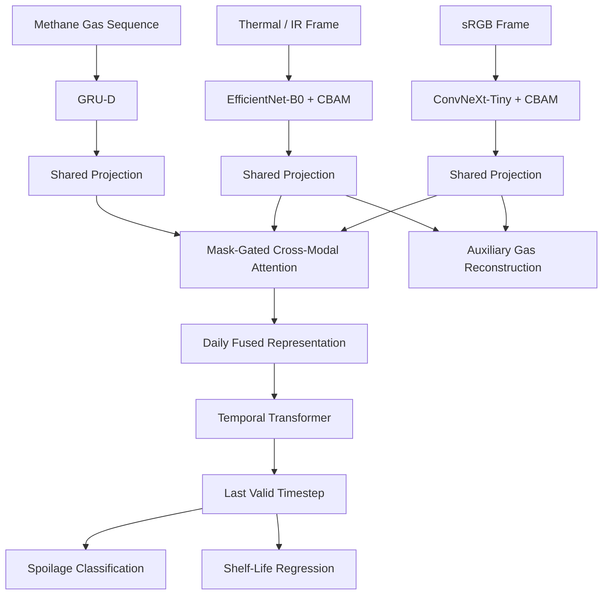

# Multimodal Fruit and Vegetable Spoilage Detection

A trimodal deep learning framework for produce-spoilage detection using **sRGB images, thermal/IR images, and methane gas-sensor data**. The system performs spoilage-stage classification and investigates days-until-spoilage regression through heterogeneous sensory fusion and temporal modelling.

## Overview

Post-harvest produce degradation is a multimodal process: visible appearance, thermal characteristics, and gas emissions provide complementary information about the underlying spoilage process. This project develops a multimodal learning pipeline that combines these signals rather than relying on a single sensor modality.

The current architecture uses:

- **sRGB:** ConvNeXt-Tiny + CBAM
- **Thermal/IR:** EfficientNet-B0 + CBAM
- **Methane gas:** GRU-D for decay-aware handling of irregular/missing observations
- **Fusion:** mask-gated cross-modal multi-head attention
- **Temporal modelling:** Transformer encoder with sinusoidal positional encoding
- **Prediction:** spoilage-stage classification + days-until-spoilage regression
- **Auxiliary objective:** gas-signal reconstruction from visual embeddings
- **Multi-task optimization:** homoscedastic uncertainty weighting

The model is designed with small-sample evaluation and eventual edge deployment in mind.

## Dataset

The experiments use the **TR-6 trimodal spoilage dataset**, containing:

- 6 produce types: Banana, Carrot, Guava, Indian Gooseberry, Mango, and Tomato
- 12 spoilage trajectories: 2 specimens per produce type
- 3 recording sessions per day: morning, afternoon, and evening
- Modalities: sRGB, thermal/IR, and methane gas
- 112 day-level entries after session-to-day aggregation
- 76 `not_spoiled` entries and 36 `spoiled` entries

The dataset is small and trajectory-based. The current implementation uses a day-level 70/15/15 train/validation/test split stratified by produce type and label.

**Important:** the current split is performed at day granularity, so a single spoilage trajectory can contribute entries to more than one split. This is an explicit limitation of the current protocol and should be considered when interpreting the results.

The dataset itself is **not included in this repository**.

## Architecture



At each day-level timestep, the three modality embeddings are projected into a shared representation space. A key-padding mask prevents unavailable modalities from contributing to cross-modal attention. The resulting daily representations are then processed as a temporal sequence.

## Why These Components?

### CBAM

CBAM applies channel and spatial attention to the visual feature maps. This allows the model to emphasize spatially informative regions such as discoloration, bruising, visible degradation, or thermal hotspots.

### GRU-D

The gas stream can contain missing or irregular observations. Instead of treating missing values as ordinary imputation, GRU-D uses the observation mask and elapsed time since the previous valid observation to learn decay behaviour.

### Mask-Gated Cross-Modal Attention

The three modalities contain heterogeneous information and may not always be simultaneously available. Feature-level attention allows the model to learn interactions between modalities while explicitly masking unavailable inputs.

### Temporal Transformer

Spoilage is a progression rather than an isolated event. The Transformer operates over the sequence of daily fused representations, allowing the model to distinguish earlier slow degradation from later rapid changes.

### Multi-Task Learning

The model jointly considers:

1. Spoilage-stage classification
2. Days-until-spoilage regression
3. Auxiliary gas reconstruction

The losses are combined using homoscedastic uncertainty weighting rather than fixed manually selected task weights.

## Repository Structure

The current codebase is organized around the following notebooks:

```text
.
├── 01_data_pipeline.ipynb
├── 02_dataset_analysis.ipynb
├── 03_encoders_baselines.ipynb
├── 04_fusion_model.ipynb
├── 05_ablation_study.ipynb
├── README.md
├── requirements.txt
├── Manifest
    ├── manifests
        ├── banana_manifest.csv
        ├── carrot_manifest.csv
        ├── guava_manifest.csv
        ├── indian_gooseberry_manifest.csv
        ├── mango_manifest.csv
        ├── tomato_manifest.csv
        ├── master_manifest.csv
    ├── GasNorm
        ├── gas_norm_stats.json
        ├── ir_scalar_norm_stats.json       
└── TR6/
    └── ...
    # dataset files, not included. Download from https://figshare.com/articles/dataset/TriModal_Ripeness_6/30783827?file=60094544 
```

The report describes the implemented workflow as:

1. Data pipeline
2. Unimodal baselines
3. Full trimodal fusion model
4. Ablation study
5. Edge-deployment benchmarking
6. Robustness and generalization experiments
7. Interpretability analysis

The first four stages are currently implemented. Edge benchmarking is partially available, while robustness/generalization and interpretability remain future work.

## Pipeline

```text
Raw multimodal data
        │
        ▼
Manifest construction
        │
        ▼
Session → day aggregation
        │
        ▼
Train / validation / test split
        │
        ├───────────────┬────────────────┐
        ▼               ▼                ▼
      sRGB             IR              Gas
        │               │                │
 ConvNeXt-Tiny      EfficientNet-B0    GRU-D
      + CBAM            + CBAM
        │               │                │
        └───────────────┴────────────────┘
                        │
                        ▼
              Shared projection space
                        │
                        ▼
          Mask-gated cross-modal attention
                        │
                        ▼
              Daily fused representations
                        │
                        ▼
               Temporal Transformer
                        │
                        ▼
             Last valid timestep
                  /           \
                 /             \
                ▼               ▼
       Classification       Regression
       spoiled /             days until
       not_spoiled           spoilage
```

## Training

The current training configuration includes:

- Optimizer: **AdamW**
- Base learning rate: `1e-4`
- IR backbone learning rate after unfreezing: `1e-5`
- Weight decay: `1e-4`
- Scheduler: cosine annealing
- Training duration: 30 epochs
- Batch size: 4 trajectories per step
- Staged visual-backbone unfreezing
- Weighted sampling to address class imbalance
- Class-weighted cross-entropy with spoiled-class weight `2.3`
- Offline geometric/photometric augmentation for robustness experiments

The visual backbones initially remain frozen and are progressively unfrozen during training.

## Evaluation

Because only 12 spoilage trajectories are available, evaluation is treated as a small-sample problem.

Classification metrics:

- Binary F1
- Macro-F1
- Accuracy
- AUC
- Per-class recall

Regression metrics:

- MAE
- RMSE
- R²

Efficiency metrics:

- Parameter count
- Approximate FLOPs
- Inference latency

The classification threshold is calibrated without using validation/test predictions for threshold selection. The final fusion model uses probability averaging across 10 independently seeded runs.

## Current Results

### Unimodal validation baselines

| Modality | Encoder | F1 | AUC | MAE |
|---|---|---:|---:|---:|
| sRGB | ConvNeXt-Tiny + CBAM | 0.7500 | 0.6944 | 2.16 days |
| IR | EfficientNet-B0 + CBAM | 0.7500 | 0.6111 | 2.17 days |
| Gas | GRU-D | 0.7692 | 0.5833 | 2.15 days |

These are single-seed validation results and are baseline reference points, not final test results.

### Full fusion model

The current full fusion model uses:

- ConvNeXt-Tiny for sRGB
- EfficientNet-B0 for IR
- GRU-D for gas
- 32.47M parameters
- approximately 39.0 GFLOPs
- approximately 54.3 ms/batch in the reported profiling setup
- 10 independently seeded training runs
- probability-averaged ensemble
- 6-fold threshold calibration
- calibrated threshold: `0.660`

Held-out test results:

| Model | Test F1 | Test AUC |
|---|---:|---:|
| Trimodal fusion ensemble | **0.8000** | **0.7333** |

The final test evaluation contains only 18 day-level entries, so these numbers should be interpreted cautiously.

The current final evaluation pipeline reports classification metrics on the held-out test set. A defensible final test-set regression result is not currently reported.

## Ablation Study

The ablation study compares seven configurations across six seeds, including:

- Full intermediate-fusion model
- No CBAM
- No cross-modal attention
- LSTM instead of temporal Transformer
- Mean imputation instead of GRU-D
- Early-fusion baseline
- Late-fusion baseline

The ablation results show that component rankings can change between single-seed averages and multi-seed ensembles. Given the small dataset and six seeds per configuration, ensemble-level ablation results should therefore be interpreted cautiously.

## Limitations

The main limitations of the current work are:

1. **Very small dataset:** only 12 spoilage trajectories are available.
2. **Day-level split:** individual trajectories can appear in multiple splits.
3. **Short and heterogeneous trajectories:** trajectory lengths vary substantially across produce types.
4. **Regression remains unresolved:** days-until-spoilage MAE remains close to baseline across configurations.
5. **Seed sensitivity:** the small sample size produces noticeable variation across random seeds.
6. **Generalization has not yet been established:** leave-one-fruit-out evaluation is still pending.
7. **Edge benchmarking is incomplete:** the planned head-to-head DINOv2 comparison has not yet been run.
8. **Interpretability is pending:** Grad-CAM and SHAP analyses have not yet been completed.
